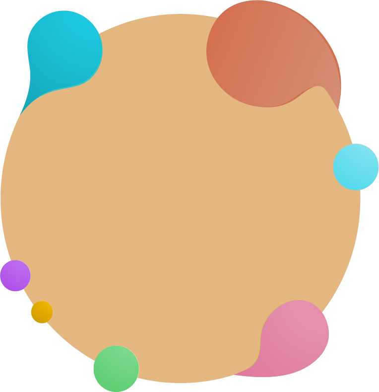

<br>
<div style="height: 100px; width:100px; margin: 0 auto">



</div>
<br>

Noctis is a collection of light & dark themes with a well balanced blend of warm and cold _medium contrast_ colors.

The theme is designed to:

-  be easy on the eyes thus reducing the eye strain
-  give semantic meaning to theme's colors

Noctis comes in six versions. Five are dark and one is light.
The background of **Noctis**, **Noctis Sereno** & **Noctis Obscuro** is a very saturated very dark cold bluish cyan, **Noctis Azureus'** is a very saturated very dark cold azure **Noctis Uva's** is a unsaturated dark cold blue. For those with more spartan taste, **Noctis Minimus** offers a version of the **Azureus** palette with _much lower saturation_. (Thank you [Draevin](https://github.com/draevin) for your [contribution](https://github.com/liviuschera/noctis/pull/10))
<br>Blue is a cool calming color that shows creativity and intelligence and has a calming effect on the psyche.<br>

**Noctis Viola's** background is a saturated very dark cold violet.<br> Like blue, violet is a calming color that can help to make wise and thoughtful decisions and encourages creative pursuits.

The **Noctis Lux** light theme's background is a very saturated very light warm orange.<br>Orange can increase oxygen supply to the brain to produce an invigorating effect.

<div style="margin: 0 auto;">

## Noctis Viola &larr; **NEW**


## Noctis Minimus &larr; **NEW**


## Noctis Uva


## Noctis


## Noctis Azureus


## Noctis Lux


</div>

## Supported Languages

-  C/C++
-  C#
-  Clojure
-  CoffeeScript
-  Crystal (requires [Crystal Language](https://marketplace.visualstudio.com/items?itemName=faustinoaq.crystal-lang) extension) &larr; **NEW**
-  CSS
   -  Sass/SCSS
-  Dart (requires [Dart](https://marketplace.visualstudio.com/items?itemName=Dart-Code.dart-code) extension)
-  Go
-  Groovy
-  Haskell (requires [Haskell Syntax Highlighting](https://marketplace.visualstudio.com/items?itemName=justusadam.language-haskell) extension)
-  HTML
   -  EJS
   -  Handlebars
   -  Pug/Jade
-  Java
-  JavaScript
   -  JSON
   -  React/JSX
   -  Typescript/TSX
-  Julia (requires [Julia](https://marketplace.visualstudio.com/items?itemName=julialang.language-julia) extension)
-  Lua (requires [Lua Plus](https://marketplace.visualstudio.com/items?itemName=jep-a.lua-plus) extension)
-  Markdown
-  Objective-C
-  PHP
   -  Laravel Blade
-  PowerShell
-  Python
-  R
-  Ruby
-  Rust
-  Scala (requires [Scala Syntax](https://marketplace.visualstudio.com/items?itemName=scala-lang.scala) extension)
-  SQL
-  Vala (requires [Vala Code](https://marketplace.visualstudio.com/items?itemName=thiagoabreu.vala) extension)
-  Visual Basic
-  **Other**
   -  Apache Conf (requires [Apache Conf](https://marketplace.visualstudio.com/items?itemName=mrmlnc.vscode-apache) extension)

I plan on adding support for new languages in the upcoming releases. Please feel free to open an issue if you'd like a new language supported or if you think something is off.

## **The Font** used in the screenshots

The font in the screenshots are actually 2 fonts glued together with [Custom CSS](https://marketplace.visualstudio.com/items?itemName=be5invis.vscode-custom-css). For normal style I used [Hasklig](https://github.com/i-tu/Hasklig) and for italics [Cartograph Mono CF](http://connary.com/cartograph.html).
I think there is a beautiful synergy between the two fonts and they intertwine naturally together.

### "How did you do it?" [#2](https://github.com/liviuschera/noctis/issues/2)

The walkthrough is for Windows. I assume that for Unix and MacOS you would have to change only the path.

1. IMPORTANT: _Run as administrator_ VS Code
2. install [Custom CSS and JS Loader](https://marketplace.visualstudio.com/items?itemName=be5invis.vscode-custom-css)
3. download or copy the content of [customvscode.css](https://github.com/liviuschera/noctis/blob/master/vscodecustom.css)
4. copy `customvscode.css` in `C:\Users\your-own-username`. As an example this is what I have on my system: `C:\Users\liviuschera\customvscode.css`
5. in `settings.json` add:
   ```json
     "editor.fontFamily": "Hasklig",
     "vscode_custom_css.imports":
       [
         "file://C:/Users/yourusername/vscodecustom.css"
       ],
   ```
6. press `F1`
7. select `Enable Custom CSS and JS`
8. reload VS Code (it doesn't have to be in administrator mode)

> NOTES:
>
> -  if VS Code complains about that it is corrupted, simply click “Don't show again”.
> -  every time after VS Code is updated or you change the configuration, please re-enable Custom CSS
> -  make sure that you comment out the optional CSS code if you don't want to change the UI's default font.

## Syntax colors

The color names were matched to one of the following main color hues: Red, Yellow, Green, Blue, Brown and Grey using the excellent online tools [Color Name & Hue](http://www.color-blindness.com/color-name-hue/) and [Name that Color](http://chir.ag/projects/name-that-color).

### Standard Colors

| Color           | Hue    | Hex Code                                                           | Used for:                                      |
| --------------- | ------ | ------------------------------------------------------------------ | ---------------------------------------------- |
| Eucalyptus      | Green  |  `#49e9a6` | Strings                                        |
| Mountain Meadow | Green  |  `#16b673` | Interpolated Strings                           |
| Horizon         | Blue   |  `#5b858b` | Comments for default theme                     |
| Smalt Blue      | Blue   |  `#507b95` | Comments for _Azureus_ variant                 |
| Kimberly        | Violet |  `#716c93` | Comments for _Uva_ variant                     |
| Trendy Pink     | Violet |  `#7f659a` | Comments for _Viola_ variant                   |
| Eastern Blue    | Blue   |  `#16a3b6` | Function Calls                                 |
| Turcoise        | Blue   |  `#49d6e9` | Method Calls                                   |
| Picton Blue     | Blue   |  `#49ace9` | Code that needs to stand out                   |
| Cornflower Blue | Blue   |  `#7060eb` | Numbers & Booleans                             |
| Pale Violet Red | Red    |  `#df769b` | Keywords & Operators                           |
| Cinnabar        | Orange |  `#e66533` | Function & Variable Declaration, Tags & `this` |
| Buddha Gold     | Yellow |  `#cc9900` | Attributes, Constants & Type annotations       |
| Gold Sand       | Yellow |  `#e4b781` | Variables & Parameters                         |
| Desert Sand     | Brown  |  `#edc9af` | Object properties, ID selectors in CSS         |

### Minimus Colors

| Color         | Hue    | Hex Code                                                           | Used for:                                      |
| ------------- | ------ | ------------------------------------------------------------------ | ---------------------------------------------- |
| Silver Tree   | Green  |  `#70c27f` | Strings                                        |
| Viridian      | Green  |  `#3f8d6c` | Interpolated Strings                           |
| Hoki          | Blue   |  `#5e7887` | Comments                                       |
| Ming          | Blue   |  `#3f848d` | Function Calls                                 |
| Glacier       | Blue   |  `#72b7c0` | Method Calls                                   |
| Fountain Blue | Blue   |  `#5998c0` | Code that needs to stand out                   |
| Chetwode Blue | Blue   |  `#7068B1` | Numbers & Booleans                             |
| Viola         | Red    |  `#c88da2` | Keywords & Operators                           |
| Antique Brass | Orange |  `#c37455` | Function & Variable Declaration, Tags & `this` |
| Husk          | Yellow |  `#b3994d` | Attributes, Constants & Type annotations       |
| Tan           | Brown  |  `#d3b692` | Variables & Parameters                         |
| Dust Storm    | Orange |  `#e1cbbc` | Object properties, ID selectors in CSS         |

### Lux Colors

| Color            | Hue    | Hex Code                                                           | Used for:                                      |
| ---------------- | ------ | ------------------------------------------------------------------ | ---------------------------------------------- |
| Jade             | Green  |  `#00b368` | Strings                                        |
| Green Haze       | Green  |  `#009456` | Interpolated Strings                           |
| Cascade          | Green  |  `#8ca6a6` | Comments                                       |
| Bondi Blue       | Blue   |  `#0095a8` | Function Calls                                 |
| Robin's Egg Blue | Blue   |  `#00bdd6` | Method Calls                                   |
| Azure Radiance   | Blue   |  `#0094f0` | Code that needs to stand out                   |
| Electric Violet  | Blue   |  `#5842ff` | Numbers & Booleans                             |
| PBrink Pink      | Red    |  `#ff5792` | Keywords & Operators                           |
| Grenadier        | Orange |  `#d13b00` | Function & Variable Declaration, Tags & `this` |
| Pirate Gold      | Yellow |  `#b38600` | Attributes, Constants & Type annotations       |
| Carrot Orange    | Orange |  `#ee962b` | Variables & Parameters                         |
| Reno Sand        | Brown  |  `#a86615` | Object properties, ID selectors in CSS         |

## Installation

Noctis can be installed by clicking on Ctrl + Shift + X on Windows or ⇧ + ⌘ + X on Mac and then searching for "Noctis".

## Contributors

| [](https://github.com/MatteoCampinoti94) | [](https://github.com/draevin) | [](https://github.com/def14nt) |
| :--------------------------------------------------------------------------------------------------------------------: | :--------------------------------------------------------------------------------------------------: | :--------------------------------------------------------------------------------------------------------: |
|                                [Matteo Campinoti](https://github.com/MatteoCampinoti94)                                |                                [Draevin](https://github.com/draevin)                                 |                                [Will Hoskings](https://github.com/def14nt)                                 |

## Credits

This theme was inspired by the themes [VS Dark](https://github.com/Microsoft/vscode/tree/master/extensions/theme-defaults/themes), [Solarized](https://ethanschoonover.com/solarized/), [Vue](https://marketplace.visualstudio.com/items?itemName=mariorodeghiero.vue-theme), [Cobalt2](https://github.com/wesbos/cobalt2-vscode), [One Dark](https://github.com/atom/atom/tree/master/packages/one-dark-syntax), [Dracula](https://draculatheme.com/visual-studio-code/), [Pure Syntax](https://atom.io/packages/pure-syntax) and many others.
