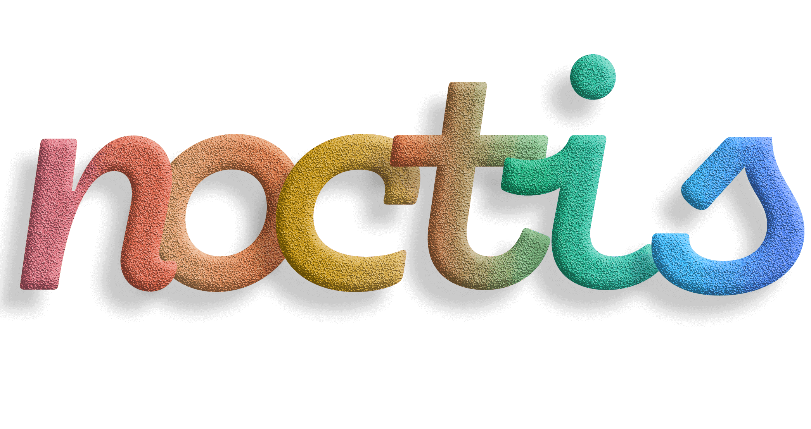

  

  

Noctis is a collection of light & dark themes with a well balanced blend of warm and cold **medium contrast** colors.

The theme is designed to:

- be easy on the eyes thus reducing the eye strain
- give semantic meaning to theme's colors

Noctis comes in 11 versions, 8 are dark and 3 are light.

- _Noctis_, _Noctis Sereno_ & _Noctis Obscuro_ background is a very saturated very dark cold bluish cyan
- _Noctis Azureus'_ background is a very saturated very dark cold azure
- _Noctis Bordo's_ background is a very unsaturated very dark warm rose
- _Noctis Uva's_ background is a unsaturated dark cold blue. For those with more spartan taste
- _Noctis Minimus'_ background offers a version of the _Azureus_ palette with **much lower saturation**. (Thank you [Draevin](https://github.com/draevin) for your [contribution](https://github.com/liviuschera/noctis/pull/10))
- _Noctis Viola's_ background is a saturated very dark cold violet
- _Noctis Lux'_ background is a very saturated very light warm orange
- _Noctis Hibernus'_ background is a very unsaturated very light cold bluish cyan
- _Noctis Lilac's_ background is a very unsaturated very light cold blue

---

> ## The font used in screenshots is called [Cartograph CF](http://connary.com/cartograph.html)

---

## Noctis

## Noctis Azureus

## Noctis Bordo

## Noctis Minimus

## Noctis Uva

## Noctis Viola

## Noctis Lux

## Noctis Lilac

## Noctis Hibernus

## Supported Languages

- Apex (requires [Salesforce Extension Pack](https://marketplace.visualstudio.com/items?itemName=salesforce.salesforcedx-vscode) extension)
- C/C++
- C#
- Clojure
- CoffeeScript
- Crystal (requires [Crystal Language](https://marketplace.visualstudio.com/items?itemName=faustinoaq.crystal-lang) extension)
- CSS
  - Sass/SCSS
- Cucumber (Gerkin) (requires [Cucumber (Gherkin) Full Support](https://marketplace.visualstudio.com/items?itemName=alexkrechik.cucumberautocompletel) extension)
- Dart (requires [Dart](https://marketplace.visualstudio.com/items?itemName=Dart-Code.dart-code) extension)
- Elm (requires [elm](https://marketplace.visualstudio.com/items?itemName=sbrink.elm) extension)
- Elixir (requires [ElixirLS: Elixir support and debugger](https://marketplace.visualstudio.com/items?itemName=JakeBecker.elixir-ls) extension)
- Erlang (requires [erlang](https://marketplace.visualstudio.com/items?itemName=pgourlain.erlang) extension)
- F#
- Go
- GraphQL (requires [GraphQL](https://marketplace.visualstudio.com/items?itemName=Prisma.vscode-graphql) extension)
- Groovy
- Haskell (requires [Haskell Syntax Highlighting](https://marketplace.visualstudio.com/items?itemName=justusadam.language-haskell) extension)
- HLSL
- HTML
  - EJS
  - Handlebars
  - Pug/Jade
- Java
- JavaScript
  - JSON
  - React/JSX
  - Typescript/TSX
- Julia (requires [Julia](https://marketplace.visualstudio.com/items?itemName=julialang.language-julia) extension)
- Kotlin (requires [Kotlin](https://marketplace.visualstudio.com/items?itemName=fwcd.kotlin) extension)
- Lua (requires [Lua](https://marketplace.visualstudio.com/items?itemName=sumneko.lua) extension)
- Markup
  - AsciiDoc (requires [AsciiDoc](https://marketplace.visualstudio.com/items?itemName=asciidoctor.asciidoctor-vscode) extension)
  - LaTeX (requires [LaTeX Workshop](https://marketplace.visualstudio.com/items?itemName=James-Yu.latex-workshop) extension)
  - Markdown
  - MJML (requires [MJML](https://marketplace.visualstudio.com/items?itemName=attilabuti.vscode-mjml) extension)
- Nim (requires [Nim](https://marketplace.visualstudio.com/items?itemName=kosz78.nim) extension)
- Objective-C
- Ocaml (requires [reason-vscode](https://marketplace.visualstudio.com/items?itemName=jaredly.reason-vscode) extension)
- PHP
  - Laravel Blade
  - Twig (requires [Twig Language 2](https://marketplace.visualstudio.com/items?itemName=mblode.twig-language-2) extension)
- PlantUML (requires [PlantUML](https://marketplace.visualstudio.com/items?itemName=jebbs.plantuml) extension)
- PowerShell
- Python
- R
- ReasonML (requires [reason-vscode](https://marketplace.visualstudio.com/items?itemName=jaredly.reason-vscode) extension)
- Ruby
- Rust
- Scala (requires [Scala Syntax](https://marketplace.visualstudio.com/items?itemName=scala-lang.scala) extension)
- SQL
- Shell Script
- Swift
- Terraform (requires [Terraform](https://marketplace.visualstudio.com/items?itemName=4ops.terraform) extension)
- Vala (requires [Vala Code](https://marketplace.visualstudio.com/items?itemName=thiagoabreu.vala) extension)
- Visual Basic
- Zig (requires [Zig Language](https://marketplace.visualstudio.com/items?itemName=ziglang.vscode-zig) extension)
- _Other_
  - Apache Conf (requires [Apache Conf](https://marketplace.visualstudio.com/items?itemName=mrmlnc.vscode-apache) extension)
  - TOML (requires [Better TOML](https://marketplace.visualstudio.com/items?itemName=bungcip.better-toml) extension)

I plan on adding support for new languages in the upcoming releases. Please feel free to open an issue if you'd like a new language supported or if you think something is off.

## Syntax colors

The color names were matched using the excellent online tools [Name that Color](http://chir.ag/projects/name-that-color) and [Color Name & Hue](http://www.color-blindness.com/color-name-hue/)

### Standard Colors

| Color           | Hex Code                                                                  | Used for:                                                 |
| --------------- | ------------------------------------------------------------------------- | --------------------------------------------------------- |
| Eucalyptus      |  | Strings                                                   |
| Mountain Meadow |  | Interpolated Strings                                      |
| Horizon         |  | Comments                                                  |
| Eastern Blue    |  | Function Calls                                            |
| Turcoise        |  | Method Calls                                              |
| Picton Blue     |  | Code that needs to stand out                              |
| Cornflower Blue |  | Numbers & Booleans                                        |
| Pale Violet Red |  | Keywords & Operators                                      |
| Cinnabar        |  | Function & Variable Declaration, Tags & `this`            |
| Japonica        |  | Object properties, ID selectors in CSS & Type annotations |
| Galliano        |  | Attributes, Constants                                     |
| Gold Sand       |  | Variables & Parameters                                    |

## Installation

Noctis can be installed by clicking on Ctrl + Shift + X on Windows or ⇧ + ⌘ + X on Mac and then searching for "Noctis".

## How to contribute

The theme building process has been greatly simplified with a clean, organized structure. The build system is powered by Node.js and makes it easy for contributors to add new theme variants or modify existing ones. In the `./src/` folder you will find:

- `build.ts` &rarr; main build orchestration and logic
- `theme-colors.ts` &rarr; all theme color palettes for syntax highlighting
- `syntax-rules.ts` &rarr; comprehensive syntax highlighting rules
- `workbench-themes.ts` &rarr; all theme versions with Workbench/UI colors

After you make changes to any of these files, simply run `npm run build` to generate the themes in the `./themes/` folder.

For detailed information about the build system, file structure, and how to add new themes, see **[BUILD-GUIDE.md](BUILD-GUIDE.md)**.

Happy hacking!

## Contributors

A big thank you to everyone who has contributed to Noctis.

<!-- Compact, GitHub-safe avatar grid -->
<table>
  <tr>
    <td align="center">
      <a href="https://github.com/MatteoCampinoti94">
         
        Matteo Campinoti
      </a>
    </td>
    <td align="center">
      <a href="https://github.com/draevin">
         
        Draevin
      </a>
    </td>
    <td align="center">
      <a href="https://github.com/kiendang">
         
        Dang Trung Kien
      </a>
    </td>
    <td align="center">
      <a href="https://github.com/CertainLach">
         
        CertainLach
      </a>
    </td>
  </tr>
  <tr>
    <td align="center">
      <a href="https://github.com/dustinbeecher">
         
        Dustin Beecher
      </a>
    </td>
    <td align="center">
      <a href="https://github.com/JatinSanghvi">
         
        Jatin Sanghvi
      </a>
    </td>
    <td align="center">
      <a href="https://github.com/zanedp">
         
        Zane D. Purvis
      </a>
    </td>
    <td align="center">
      <a href="https://github.com/liviuschera/noctis/graphs/contributors">
         
        and more…
      </a>
    </td>
  </tr>
</table>

Contributions welcome — see [`BUILD-GUIDE.md`](BUILD-GUIDE.md) to get started.

## Credits

This theme was inspired by the themes [VS Dark](https://github.com/Microsoft/vscode/tree/master/extensions/theme-defaults/themes), [Solarized](https://ethanschoonover.com/solarized/), [Vue](https://marketplace.visualstudio.com/items?itemName=mariorodeghiero.vue-theme), [Cobalt2](https://github.com/wesbos/cobalt2-vscode), [One Dark](https://github.com/atom/atom/tree/master/packages/one-dark-syntax), [Dracula](https://draculatheme.com/visual-studio-code/), [Pure Syntax](https://atom.io/packages/pure-syntax) and many others.
