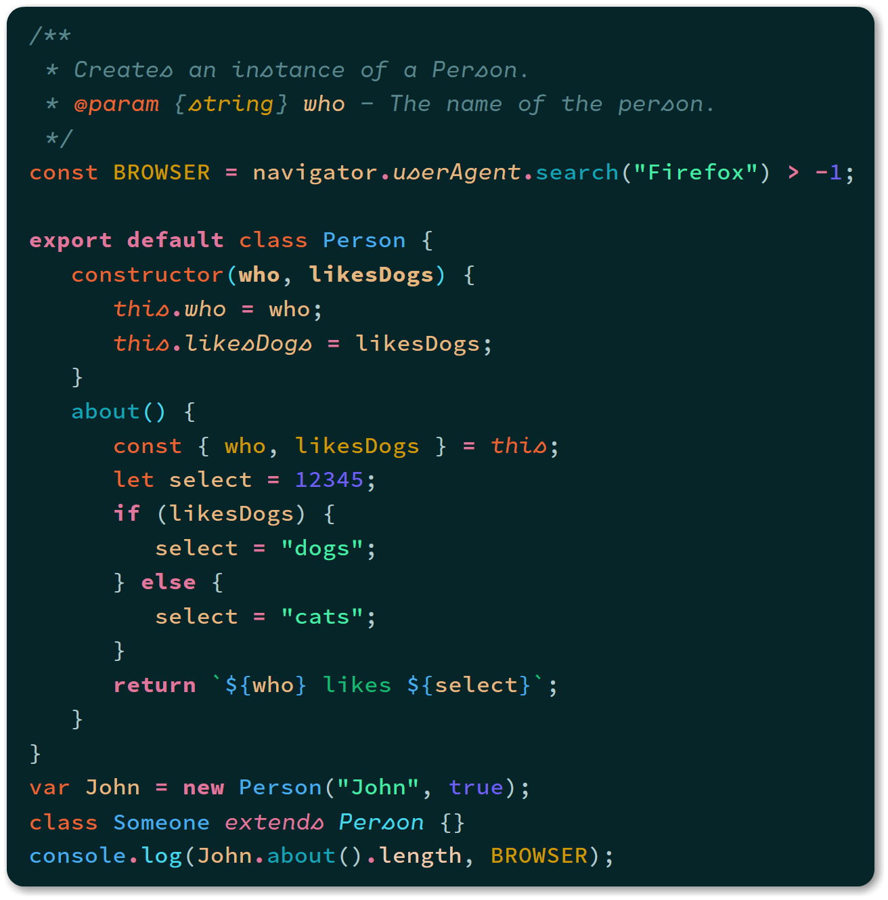
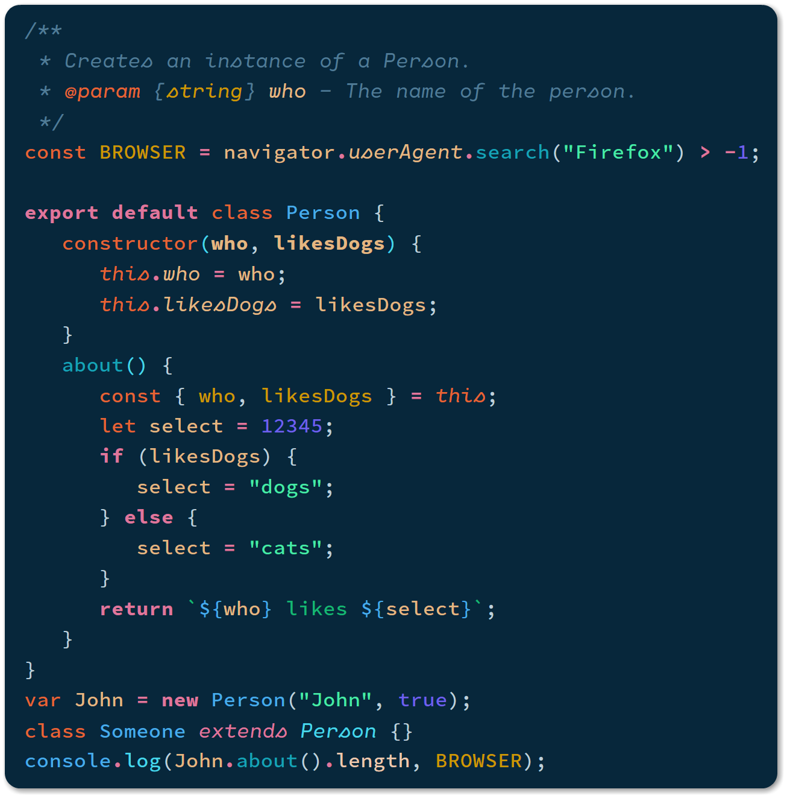
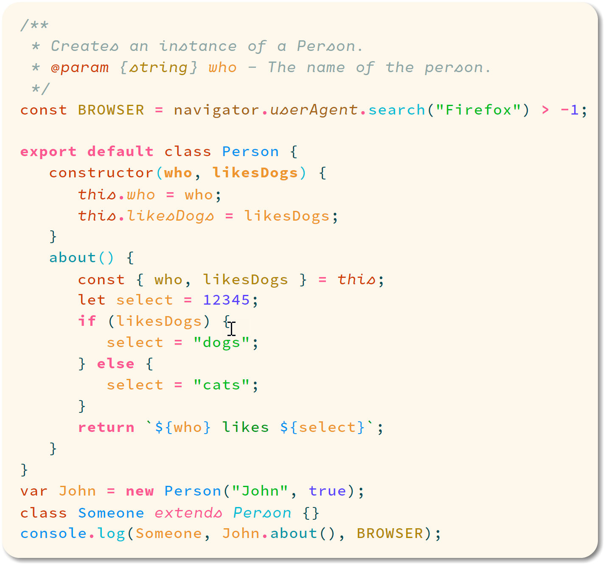

# Noctis Theme

## Supported Languages

- C#  &larr; **NEW**
- Clojure
- CSS
   - Sass/SCSS
- HTML
   - EJS
   - Handlebars
   - Pug/Jade
- JavaScript
   - JSON
   - React/JSX
   - Typescript
- Markdown
- PHP
- Python

I plan on adding support for new languages in the upcomming releases. Please feel free to open an issue if you'd like a new language supported or if you think something is off.

______

Noctis is a colection of light & dark themes with a well balanced blend of warm and cold medium contrast colors.

The theme is designed to:
-  be easy on the eyes thus reducing the eye strain
-  give semantic meaning to theme's colors

Noctis comes in five versions. Four are dark and one is light.

The background of the three dark variants is a very saturated very dark cold bluish cyan. The background of the fourth version is a very saturated very dark cold azure. Blue is a cool calming color that shows creativity and intelligence and has a calming effect on the psyche.

The light's theme background is a very saturated very light warm orange. Orange can increase oxygen supply to the brain to produce an invigorating effect.

## Noctis

## Noctis Azureus

## Noctis Lux

## Syntax colors

The color names were matched to one of the following main color hues: Red, Yellow, Green, Blue, Brown and Grey using the excelent online tools [Color Name & Hue](http://www.color-blindness.com/color-name-hue/) and [Name that Color](http://chir.ag/projects/name-that-color).

| Color           | Hue    | Hex Code                                                           | Font Style | Used for:                                                              |
| --------------- | ------ | ------------------------------------------------------------------ | ---------- | ---------------------------------------------------------------------- |
| Pastel Green    | Green  |  `#57db6f` | normal     | Strings                                                                |
| La Palma        | Green  |  `#15ac31` | normal     | String Template Literals                                               |
| Horizon         | Blue   |  `#5b858b` | _italic_   | Comments                                                               |
| Eastern Blue    | Blue   |  `#16a3b6` | normal     | User Named Functions                                                   |
| Turcoise        | Blue   |  `#49d6e9` | normal     | Object Methods                                                         |
| Dodger Blue     | Blue   |  `#33b1ff` | normal     | Built-In Objects, other important things to be highlighted             |
| Cornflower Blue | Blue   |  `#7060eb` | normal     | Number & Boolean                                                       |
| Pale Violet Red | Red    |  `#df769b` | __bold__   | Keywords & Operators                                                   |
| Burnt Sienna    | Brown  |  `#e97749` | mixed      | Function & Variable Declaration, Tags and `this`/`self`/`cls` keywords |
| Buddha Gold     | Yellow |  `#cc9900` | mixed      | Attributes, Constants and DOM objects                                  |
| Gold Sand       | Yellow |  `#e4b781` | normal     | Variable, Property and Argument Names                                  |

## Installation

Noctis can be installed by clicking on Ctrl + Shift + X on Windows or ⇧ + ⌘ + X on Mac and then searching for "Noctis".

## Credits

This theme was inspired by the themes VS Dark+, Solarized, Vue, Cobalt2 and One Dark.
