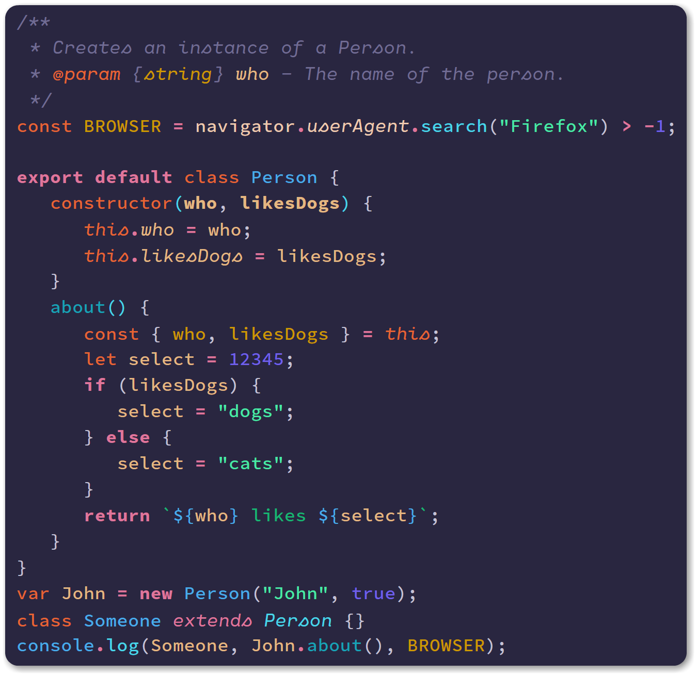

<div align="center">

## Noctis Uva &larr; **NEW**



## Noctis


## Noctis Azureus


## Noctis Lux


</div>

Noctis is a colection of light & dark themes with a well balanced blend of warm and cold _medium contrast_ colors.

The theme is designed to:

-  be easy on the eyes thus reducing the eye strain
-  give semantic meaning to theme's colors

Noctis comes in six versions. Five are dark and one is light.

The background of **Noctis**, **Noctis Sereno** & **Noctis Obscuro** is a very saturated very dark cold bluish cyan, **Noctis Azureus'** is a very saturated very dark cold azure and **Noctis Uva's** is a unsaturated dark cold blue.<br>Blue is a cool calming color that shows creativity and intelligence and has a calming effect on the psyche.

The **Noctis Lux** light theme's background is a very saturated very light warm orange.<br>Orange can increase oxygen supply to the brain to produce an invigorating effect.

## Supported Languages

-  C/C++
-  C#
-  Clojure
-  CoffeeScript
-  CSS
   -  Sass/SCSS
-  Dart (requires [Dart](https://marketplace.visualstudio.com/items?itemName=Dart-Code.dart-code) extension)
-  Go
-  Groovy
-  Haskell (requires [Haskell Syntax Highlighting](https://marketplace.visualstudio.com/items?itemName=justusadam.language-haskell) extension)
-  HTML
   -  EJS
   -  Handlebars
   -  Pug/Jade
-  Java
-  JavaScript
   -  JSON
   -  React/JSX
   -  Typescript/TSX
-  Julia (requires [Julia](https://marketplace.visualstudio.com/items?itemName=julialang.language-julia) extension)
-  Lua (requires [Lua Plus](https://marketplace.visualstudio.com/items?itemName=jep-a.lua-plus) extension)
-  Markdown
-  Objective-C
-  PHP
   -  Laravel Blade
-  PowerShell
-  Python
-  R
-  Ruby
-  Rust
-  Scala (requires [Scala Syntax](https://marketplace.visualstudio.com/items?itemName=scala-lang.scala) extension)
-  SQL &larr; **NEW**
-  Vala (requires [Vala Code](https://marketplace.visualstudio.com/items?itemName=thiagoabreu.vala) extension)
-  Visual Basic
-  **Other**
   -  Apache Conf (requires [Apache Conf](https://marketplace.visualstudio.com/items?itemName=mrmlnc.vscode-apache) extension)

I plan on adding support for new languages in the upcomming releases. Please feel free to open an issue if you'd like a new language supported or if you think something is off.

## **The Font** used in the screenshots

The font in the screenshots are actually 2 fonts glued together with [Custom CSS](https://marketplace.visualstudio.com/items?itemName=be5invis.vscode-custom-css). For normal style I used [Hasklig](https://github.com/i-tu/Hasklig) and for italics [Cartograph Mono CF](http://connary.com/cartograph.html).
I think there is a beautiful synergy between the two fonts and they intertwine naturally together.

### "How did you do it?" [#2](https://github.com/liviuschera/noctis/issues/2)

The walkthrough is for Windows. I assume that for Unix and MacOS you would have to change only the path.

1. IMPORTANT: _Run as aministrator_ VS Code
2. install [Custom CSS and JS Loader](https://marketplace.visualstudio.com/items?itemName=be5invis.vscode-custom-css)
3. download or copy the content of [customvscode.css](https://github.com/liviuschera/noctis/blob/master/vscodecustom.css)
4. copy `customvscode.css` in `C:\Users\your-own-username`. As an example this is what I have on my system: `C:\Users\liviuschera\customvscode.css`
5. in `settings.json` add:
   ```json
     "editor.fontFamily": "Hasklig",
     "vscode_custom_css.imports":
       [
         "file://C:/Users/yourusername/vscodecustom.css"
       ],
   ```
6. press `F1`
7. select `Enable Custom CSS and JS`
8. reload VS Code (it doesn't have to be in administrator mode)

> NOTES:
>
> -  if VS Code complains about that it is corrupted, simply click “Don't show again”.
> -  every time after VS Code is updated or you change the configuration, please re-enable Custom CSS
> -  make sure that you comment out the optional CSS code if you don't want to change the UI's default font.

## Syntax colors

The color names were matched to one of the following main color hues: Red, Yellow, Green, Blue, Brown and Grey using the excelent online tools [Color Name & Hue](http://www.color-blindness.com/color-name-hue/) and [Name that Color](http://chir.ag/projects/name-that-color).

| Color           | Hue    | Hex Code                                                           | Used for:                                      |
| --------------- | ------ | ------------------------------------------------------------------ | ---------------------------------------------- |
| Eucalyptus      | Green  |  `#49e9a6` | Strings                                        |
| Mountain Meadow | Green  |  `#16b673` | Interpolated Strings                           |
| Horizon         | Blue   |  `#5b858b` | Comments                                       |
| Eastern Blue    | Blue   |  `#16a3b6` | Function Calls                                 |
| Turcoise        | Blue   |  `#49d6e9` | Method Calls                                   |
| Dodger Blue     | Blue   |  `#33b1ff` | Code that needs to stand out                   |
| Cornflower Blue | Blue   |  `#7060eb` | Numbers & Booleans                             |
| Pale Violet Red | Red    |  `#df769b` | Keywords & Operators                           |
| Cinnabar        | Orange |  `#e66533` | Function & Variable Declaration, Tags & `this` |
| Buddha Gold     | Yellow |  `#cc9900` | Attributes, Constants & Type annotations       |
| Gold Sand       | Yellow |  `#e4b781` | Variables & Parameters                         |
| Desert Sand     | Brown  |  `#edc9af` | DOM Objects                                    |

## Installation

Noctis can be installed by clicking on Ctrl + Shift + X on Windows or ⇧ + ⌘ + X on Mac and then searching for "Noctis".

## Credits

This theme was inspired by the themes VS Dark+, Solarized, Vue, Cobalt2, One Dark, Dracula, Pure Syntax and many others.
